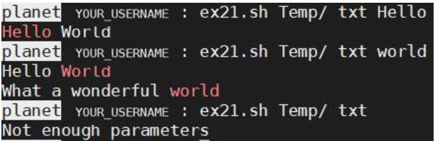
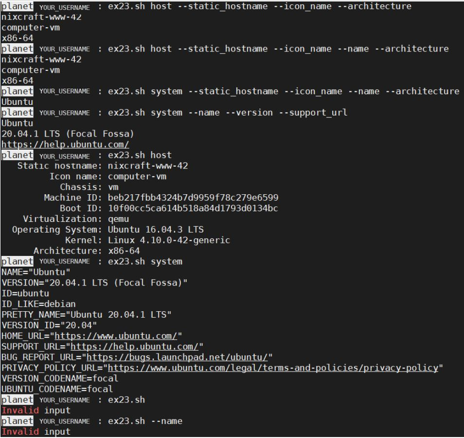

# Bash-script Intro
This is an exercise as part of Operating Systems course at Bar Ilan University. 
- Receiving input from CLI and printing output.
- Using switch case and bash commands.
- Invoking bash scripts.

ex21

ex22

ex23

