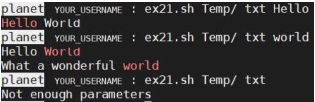
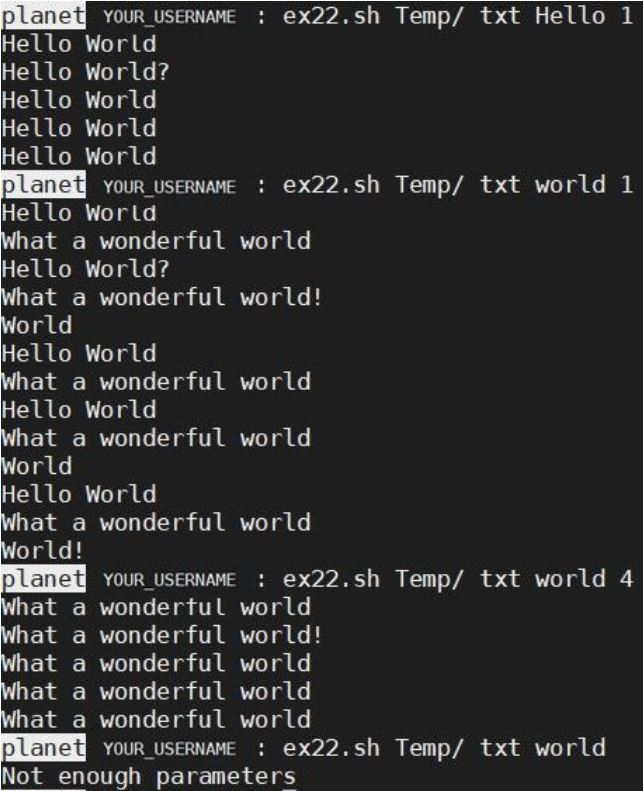
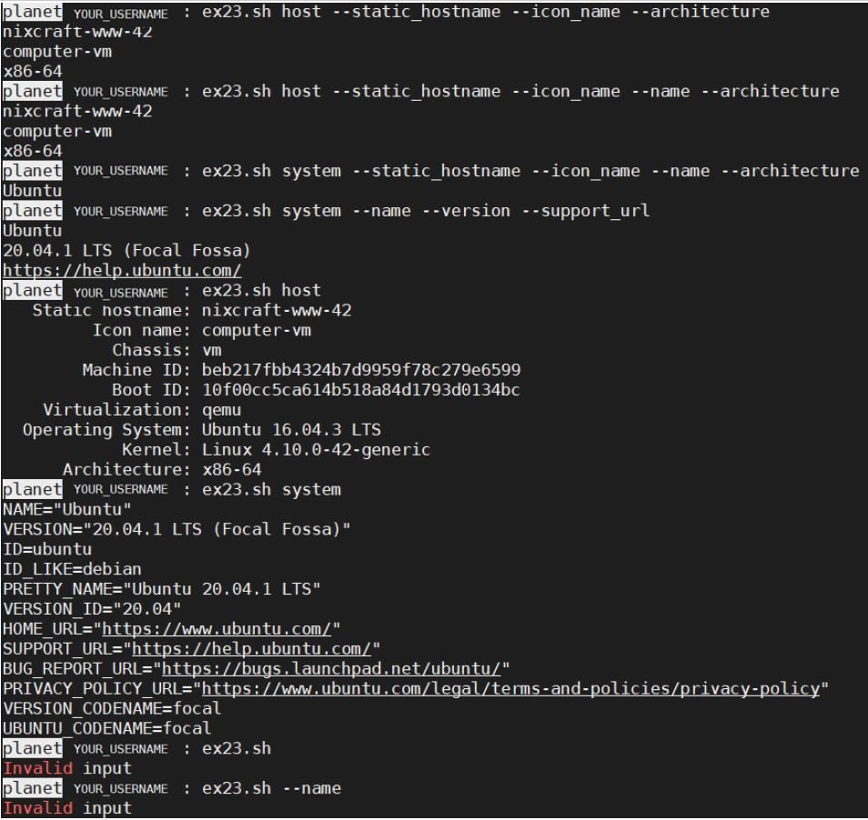

# Operating-Systems
- Task 1 - Linux Shell.
- Task 2 - Bash-script.
- Task 3 - Proccess & Files.
- Task 4 - Thread-Pool.

## Task 1 - Creating Linux shell using C
This is an implementation of Linux shell as part of Operating Systems course at Bar Ilan University. 
The main goal of this exercise is to understand and work with processes, using fork and exec commands in C.

There are 2 different types of commands:
1. Built-in - commands executed by the parent process.
2. not built-in - commands executed by son process using different program code.

The user can invoke the commands in 2 different approaches:
1. Foreground - command executed by a child process, the parent will wait until the child process is finished.
2. Background - command executed by a child process, but the parent wont wait for the child process to finish.

Built-in commands implemented:
1. jobs - shows a list of running commands in the background(according to their chronological order).
2. history - shows all the commands the user invoked while using the shell(according to their chronological order).
3. cd - changes the current process working directory.
4. exit - stops the shell and exit the program.

## Task 2 - Bash-script Intro
This is an exercise as part of Operating Systems course at Bar Ilan University. 
- Receiving input from CLI and printing output.
- Using switch case and bash commands.
- Invoking bash scripts.

ex21

ex22

ex23

## Proccess-and-Files
This repo is part of Operating Systems course at Bar Ilan University. 

- Working with file-descriptors.
- I/O redirection.
- Parsing files and working with Strings.
- Using dirent C struct.

## ThreadPool
This is a thread-pool implementation as part of Operating Systems course at Bar Ilan University. 
- Creating number of threads to perform number of tasks.
- Inserting tasks to missions queue.
- Destroying the thread pool and free all allocated resources.

